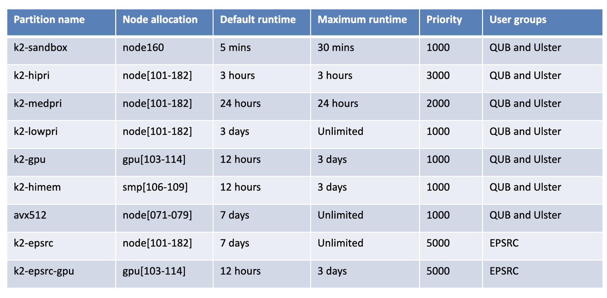

Introduction to Kelvin2 HPC
###########################
Kelvin2 is a high-performance computing (HPC) cluster at Queen’s University Belfast (QUB). The operating system is currently CentOS Linux 7 (Core) and Slurm is currently used as a workload manager/job scheduler. The current hardware specifications are kept up-to-date `here <https://ni-hpc.ac.uk/Kelvin2/>`_

Learn more from `latest Kelvin2 training <https://gitlab.qub.ac.uk/qub_hpc/kelvin_training>`_

Module basics
**************
The ``module`` package is available on Kelvin2, allowing users to access non-standard tools or alternate versions of standard packages. This is also an alternative way to configure your environment as required by certain packages. Specific modules can be loaded and unloaded as required. 

**Common ``module`` commands**:

``module avail`` List available packages.

``module load [modulefile]``	Loads module or specifies which dependencies have not been loaded.

``module unload [modulefile]``	Unloads specified module from environment.

``module list``	List currently loaded modules.

slurm basics
**************
`slurm <https://slurm.schedmd.com/documentation.html>`_ is a job scheduling system as well as workload manager for Linux clusters. 

Slurm key functions:

* provides a framework for starting, executing, and monitoring work (normally a set of parallelisable jobs) on a set of allocated nodes. 
* allocates access to resources (compute nodes) to users for some duration of time so they can perform work.
* resolves contention for resources by managing a queue of pending work.

Partitions
************
`Partitions <https://slurm.schedmd.com/quickstart.html>`_ can be considered as independent job queues. Partitions group nodes into logical sets, each of which has an assortment of constraints such as: job size limit, job time limit, permitted users, etc. To some extent, jobs are priortised according to the amount of resources requested or partition requested. 

When a user submits a job to a specific partiton, the scheduler determines if the requested hardware/time requirements of the job match up with the resources that the partition provides. If a match can be made, then the job is executed when there are available resources. If there are no available resources, then the job will be held until the next scheduler iteration to see whether resources have become available.

For Kelvin2, the default maximum runtime for a submitted job is 3 hours (k2-hipri partition). If a job takes longer than the maximum time allowed, then it will be terminated. For a longer runtime time, you must specify a partition that facilitates a longer runtime. 

Here is the list of partitions available on Kelvin2 and their constraints (as of 1 Dec 2022):

.. tip::
   Specify ``k2-medpri`` partition if your job needs to be run longer than 3 hours and would finish within 24 hours.
   

To request a ``k2-medpri`` partition with a spefic runtime for your job, add the following lines into your job script:

.. code-block:: bash
   
   #!/bin/bash
   #SBATCH --time=10:30:00
   #SBATCH --partition=k2-medpri

Launch interactive session
****************************
Interactive sessions allow users to run interactive application directly on a compute node. Users can specify resources required.

The following command launches an interactive session on Kelvin2:

.. code-block:: console
   
   srun --pty /bin/bash

To request an inteactive session with 10GB of memory and at least 4 cores:

.. code-block:: console
   
   srun --mem 10000 --mincpus 4 --pty /bin/bash

.. note::
   An interactive job will start immediately if the requested resources are avaliable. Otherwise, it will wait in the queue.

Non-interactive jobs
***********************

Common commands:
================

``sbatch [jobscript]`` submit a job script to the job queue. (A Job ID will be printed out on your terminal upon a job submission)

``squeue -u [userid]``	view status of jobs submitted by a user (i.e. Job ID, Job Name, Job State (ST))

``scancel -j [jobid]``	cancel a pending or running job

``scancel -u [userid]``	cancel all jobs submitted by a user

.. note::
   ``squeue`` lists jobs existing on the system. The ST field shows job states (R=running, PD=pending, F=failed)
   
   
  
Useful commands:
====================

sacct
------

``sacct`` displays details of a completed job, including the amount of resources used (e.g. CPU, Memory, runtime).

.. tip::
   Sometimes, it can be useful to know the amount of resources required to complete a job. This is so that we can optimise the resource allocations for that type of job in future. For example, if we see that a particular type of job never uses more than 2GB of RAM, then we can assign it to smaller compute nodes.

To check resource usage of a completed job used the ``sacct`` command. 

.. code-block:: console
   
   sacct -j [jobid] --format="JobID,Jobname,State,partition,elapsed,AllocCPUS,nnodes,MaxRSS,CPUTime"
   
   
.. note::   
   Note that you will need to know the JobID of the job you would like to check. 
   `More details and options on sacct <https://slurm.schedmd.com/sacct.html>`_

scontrol
---------

``scontrol`` view or modify configuration (e.g. partition, node) and state of submitted jobs.

Example: To change a requested partion of a submitted job to ``k2-hipri`` (e.g. from ``k2-medpri``):

.. code-block:: console

   scontrol update jobid=[jobid] Partition=k2-hipri TimeLimit=02:59:00

.. tip::
   If you have a submitted job that requests to be run on a ``medpri`` partition and it has been waiting in the queue for too long because the cluster is busy, sometimes changing the partition to ``hipri`` will allow the job to be processed more quickly (Note: this will only work if the job can complete within 3 hours)   

`More details and options on sontrol <https://slurm.schedmd.com/scontrol.html>`_

   

