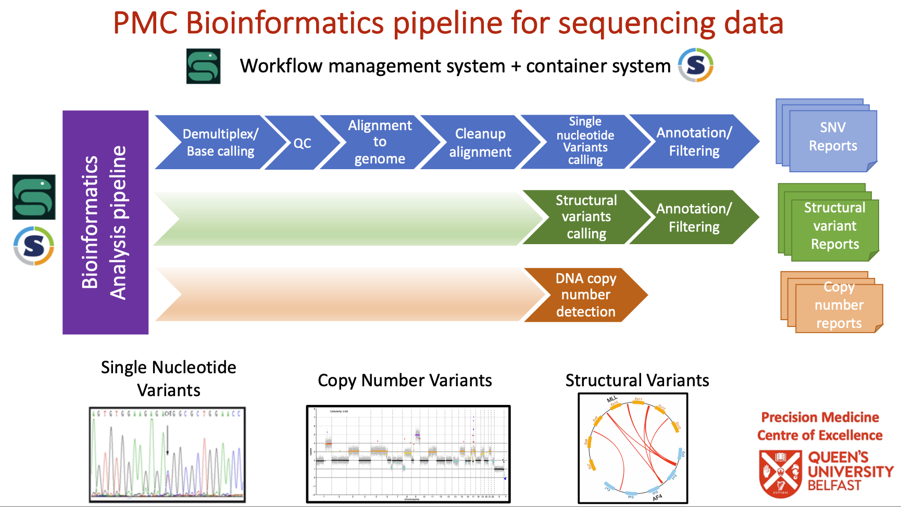
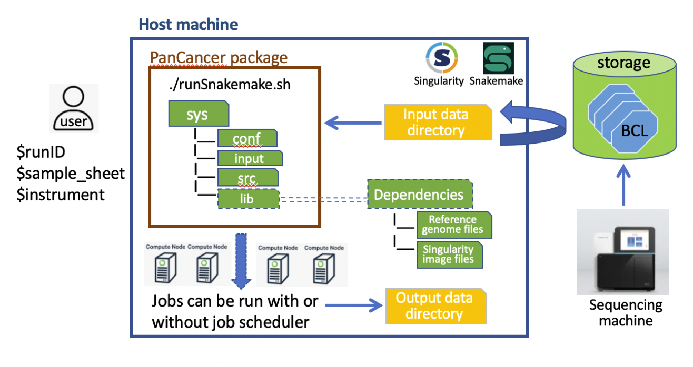

PanCancer analysis package
#################################

Overview of PanCancer_WF package
********************************

The PanCancer analysis (PanCancer_WF) package  contains a comprehensive automated workflow that performs various types of analyses commonly required for cancer genome analysis. The package is designed to identify: 
* single nucleotide variants (SNV) and small insertions/deletions (INDEL) variants; 
* large structural variants (SV); 
* Copy number alterations; and
* microsatellite instability from targeted sequencing data.

The PanCancer_WF is composed of two main components: 

* Source code - a set of inter-related scripts that automates the execution of the workflow, version controlled on `GitHub <https://github.com/PMC-QUB-HTS/PanCancer_WF>`_; 

* Dependencies of the workflow - mainly composed of reference data files and Singularity image files. The dependencies are readily accessible on Kelvin2 HPC.

Structure of PanCancer_WF package
**********************************

The PanCancer workflow package has the following folder structure:

* ``runSnakemake.sh`` a bash script to launch the analysis workflow. This is a wrapper script that perform the foloowing steps:
  
  1. initialises the system by automatically configuring the correct environment for the run (e.g. download relevant BCL folder, generate run-specific configuration files etc.)
  
  2. Execute the Snakemake workflow, which creates a set of required compute jobs and submit jobs to a job scheduler

* ``sys/`` a directory containing files necessary for the workflow to run successfully. The directory contains three sub-directories:
  
  1. ``conf/`` contains: 1) pre-defined configuration files specific to the workflow; 2) run-specific configuration files (i.e., sample_sheet.yaml and misc.yaml files) generated when executing the runScript.sh script.
  
  2. ``input/`` contains input files specific to the PanCancer project such as target bed file and transcript of interest list etc.
  
  3. ``src/`` contains Snakemake and accessory scripts

``runSnakemake.sh``

.. code-block:: bash
  :linenos:

  module load apps/singularity/3.4.2
  module load snakemake/V5.31.1_Python3.8.5
  runID=$1
  sampSheet=$2
  platform=$3 #NovaSeq or NextSeq
  organization=$4
  runMode=slurm #node, testrun (i.e. Snakemake dry-run), or else (i.e. HPC)
  pathtobcl=kelvin #'kelvin' or 'path to bcl file'
  storage1=autofs/mcclayrds-instruments
  libPath=/mnt/userapps/pmc_apps/lib
  bn=${PWD}/sys/src
